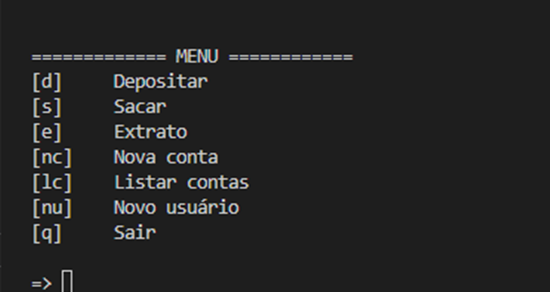

#  Optimized Simple Banking System

Optimized Simple Banking System é uma continuação do programa que simula um ambiente bancário simples com operações de depósitos, saques e extratos. Nele foi adicionado novos recursos que possibilida a criação de contas bancárias.

## O Desafio

### Foram feitas algumas implementações como:

<ol>
    <li>A possibilidade de criar um novo usuário</li>
    <li>A associação da conta por CPF</li>
    <li>Listagem de contas</li>
    <li>Criação de mais de uma conta por usuário</li>
</ol>

O Cliente poderá solicitar 3 saques diários com limite máximo de R$ 500,00 por saque.

## Menu de operações 

O programa exibir um menu onde o cliente pode escolher uma das opções como mostra a imagem

## Desafio realizado durante o Bootcamp Potência Tech powered by iFood | Ciência de Dados promovido por: 

<a href="https://www.dio.me">Digital Innovation one</a>